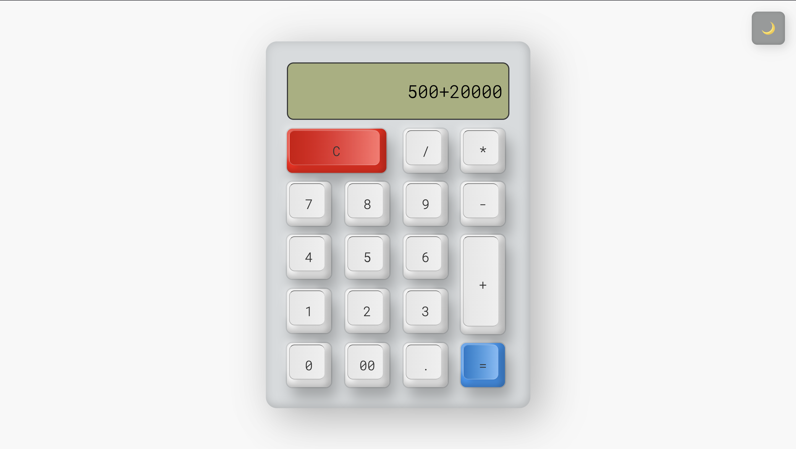
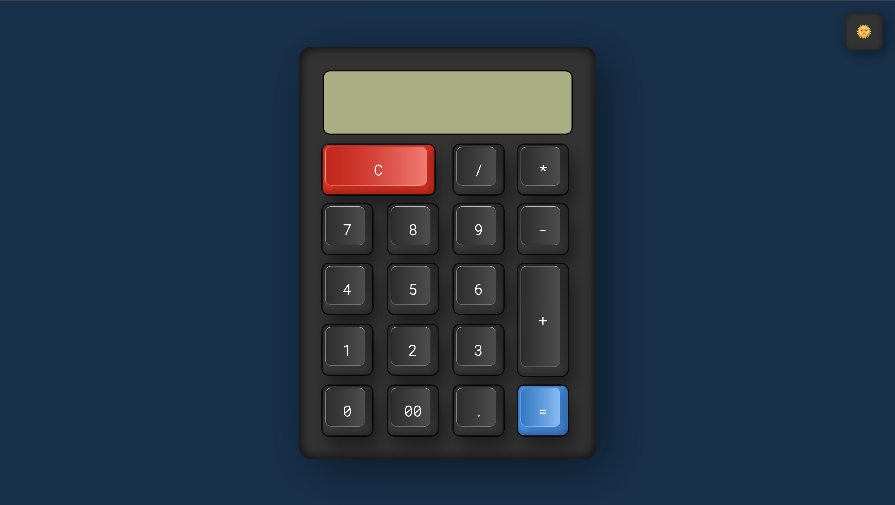

# Calculator with Dark/Light Theme

A clean, fully functional calculator built with **HTML**, **CSS**, and **JavaScript**. Features a smooth **dark/light theme toggle** with persistent preference.

  

## Live Demo

[Click here to use the calculator →](https://mohamedilham914.github.io/calculator/)

## Features

- Basic operations: `+`, `−`, `×`, `÷`
- Clear (C), decimal point, and double-zero (00)
- Real-time calculation
- Dark/Light theme toggle (saved in browser)
- Fully interactive buttons with hover effects
- Mobile-friendly & responsive
- Pure vanilla JS – no frameworks

## Tech Stack

- HTML5 · CSS3 · Vanilla JavaScript

## How to Run Locally

Just open `index.html` in any browser!

## Screenshots

**Light Theme**  

**Dark Theme**  

Made with ❤️ by [mohamedilham914](https://github.com/mohamedilham914)

⭐ Star this repo if you like it!
